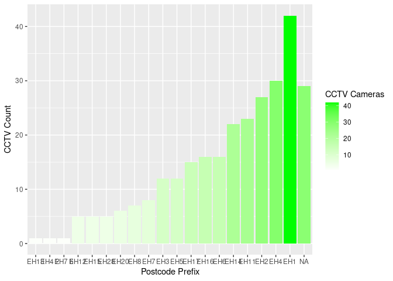
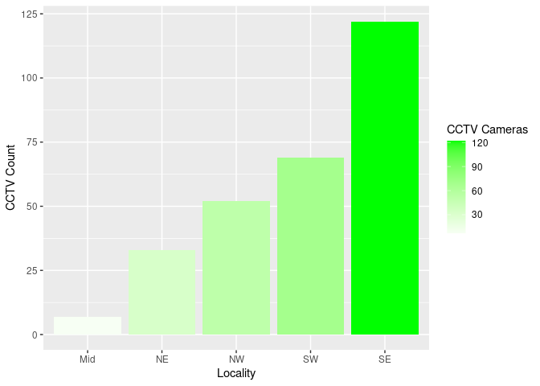

Preview: Sourced Dataframes
================

``` r
knitr::opts_chunk$set(echo = TRUE, include = TRUE)
source("data_input.R")
```

    ## ── Attaching core tidyverse packages ──────────────────────── tidyverse 2.0.0 ──
    ## ✔ dplyr     1.1.4     ✔ purrr     1.0.2
    ## ✔ forcats   1.0.0     ✔ stringr   1.5.1
    ## ✔ ggplot2   3.4.3     ✔ tibble    3.2.1
    ## ✔ lubridate 1.9.3     ✔ tidyr     1.3.0
    ## ── Conflicts ────────────────────────────────────────── tidyverse_conflicts() ──
    ## ✖ dplyr::filter() masks stats::filter()
    ## ✖ dplyr::lag()    masks stats::lag()
    ## ℹ Use the conflicted package (<http://conflicted.r-lib.org/>) to force all conflicts to become errors
    ## Rows: 283 Columns: 11
    ## ── Column specification ────────────────────────────────────────────────────────
    ## Delimiter: ","
    ## chr (5): Location, Location_A, Ward, Locality, Postcode
    ## dbl (6): X, Y, OBJECTID, Camera_Num, Easting, Northing
    ## 
    ## ℹ Use `spec()` to retrieve the full column specification for this data.
    ## ℹ Specify the column types or set `show_col_types = FALSE` to quiet this message.

``` r
library(knitr)
```

## Introduction

This document is used to test and preview the feed of data from the
sourced `data_input.R` file.

At present, the dataset comes from the City of Edinburgh Council’s open
data sets, and shares attributes about each public CCTV camera in the
city.

These attributes include location and ID number.

## Previewing Dataframes

##### df

This is the main dataset, with an added column that takes the initial
prefix of the postcode.

``` r
kable(
  df
)
```

|      X |      Y | OBJECTID | Camera_Num | Location                                  | Location_A                                                                                                                                                       | Ward                     | Locality | Easting | Northing | Postcode | PostcodePrefix |
|-------:|-------:|---------:|-----------:|:------------------------------------------|:-----------------------------------------------------------------------------------------------------------------------------------------------------------------|:-------------------------|:---------|--------:|---------:|:---------|:---------------|
| 325608 | 673564 |        1 |       1000 | Lawnmarket                                | The junction of Lawnmarket and George IV Bridge, Edinburgh                                                                                                       | City Centre              | SE       |  325608 |   673564 | EH1 2PH  | EH1            |
| 325672 | 673601 |        2 |       1010 | St Giles Street                           | The junction of St Giles St. and High Street, Edinburgh                                                                                                          | City Centre              | SE       |  325672 |   673601 | EH1 1RQ  | EH1            |
| 325672 | 673601 |        3 |       1011 | St Giles Street Static                    | The junction of St Giles St. and High Street, Edinburgh                                                                                                          | City Centre              | SE       |  325672 |   673601 | EH1 1RQ  | EH1            |
| 325734 | 673654 |        4 |       1021 | Warriston Close Static 01                 | Warriston’s Close, Edinburgh                                                                                                                                     | City Centre              | SE       |  325734 |   673654 | EH1 1RQ  | EH1            |
| 325734 | 673654 |        5 |       1022 | Warriston Close Static 02                 | Warriston’s Close, Edinburgh                                                                                                                                     | City Centre              | SE       |  325734 |   673654 | EH1 1RQ  | EH1            |
| 325792 | 673630 |        6 |       1030 | City Chambers                             | High St (opposite Old Fishmarket Close), Edinburgh                                                                                                               | City Centre              | SE       |  325792 |   673630 | EH1 1YF  | EH1            |
| 325792 | 673630 |        7 |       1031 | City Chambers Static 01                   | High St (opposite Old Fishmarket Close), Edinburgh                                                                                                               | City Centre              | SE       |  325792 |   673630 | EH1 1YF  | EH1            |
| 325792 | 673630 |        8 |       1032 | City Chambers Static 02                   | High St (opposite Old Fishmarket Close), Edinburgh                                                                                                               | City Centre              | SE       |  325792 |   673630 | EH1 1YF  | EH1            |
| 325942 | 673595 |        9 |       1040 | Hunter Square                             | Hunter Square, Edinburgh                                                                                                                                         | City Centre              | SE       |  325942 |   673595 | EH1 1HN  | EH1            |
| 325942 | 673595 |       10 |       1041 | Hunter Square Static                      | Hunter Square, Edinburgh                                                                                                                                         | City Centre              | SE       |  325942 |   673595 | EH1 1HN  | EH1            |
| 325947 | 673665 |       11 |       1050 | Tron Kirk                                 | The junction of the High Street and the North Bridge, Edinburgh                                                                                                  | City Centre              | SE       |  325947 |   673665 | EH1 1SG  | EH1            |
| 325947 | 673665 |       12 |       1051 | Tron Kirk Camera Static 01                | The junction of the High Street and the North Bridge, Edinburgh                                                                                                  | City Centre              | SE       |  325947 |   673665 | EH1 1SG  | EH1            |
| 325947 | 673665 |       13 |       1052 | Tron Kirk Camera Static 02                | The junction of the High Street and the North Bridge, Edinburgh                                                                                                  | City Centre              | SE       |  325947 |   673665 | EH1 1SG  | EH1            |
| 325947 | 673665 |       14 |       1053 | Tron Kirk Camera Static 03                | The junction of the High Street and the North Bridge, Edinburgh                                                                                                  | City Centre              | SE       |  325947 |   673665 | EH1 1SG  | EH1            |
| 325947 | 673665 |       15 |       1054 | Tron Kirk Camera Static 04                | The junction of the High Street and the North Bridge, Edinburgh                                                                                                  | City Centre              | SE       |  325947 |   673665 | EH1 1SG  | EH1            |
| 325977 | 673620 |       16 |       1060 | Niddry Street                             | Niddry Street, Edinburgh                                                                                                                                         | City Centre              | SE       |  325977 |   673620 | EH1 1LG  | EH1            |
| 326159 | 673695 |       17 |       1070 | St Mary’s Street                          | The junction of High Street and St. Marys Street, Edinburgh                                                                                                      | City Centre              | SE       |  326159 |   673695 | NA       | NA             |
| 326159 | 673695 |       18 |       1071 | St Mary’s Street Static                   | NA                                                                                                                                                               | City Centre              | SE       |  326159 |   673695 | NA       | NA             |
| 326009 | 673410 |       19 |       1300 | Infirmary St                              | The junction of Infirmary Street and the South Bridge, Edinburgh                                                                                                 | City Centre              | SE       |  326009 |   673410 | EH1 1LL  | EH1            |
| 325720 | 673249 |       20 |       1500 | Greyfriars                                | The junction of Forrest Road and George IV Bridge, Edinburgh                                                                                                     | City Centre              | SE       |  325720 |   673249 | EH1 2QH  | EH1            |
| 325720 | 673249 |       21 |       1501 | Greyfriars Static 01                      | The junction of Forrest Road and George IV Bridge, Edinburgh                                                                                                     | City Centre              | SE       |  325720 |   673249 | EH1 2QH  | EH1            |
| 325720 | 673249 |       22 |       1502 | Greyfriars Static 02                      | The junction of Forrest Road and George IV Bridge, Edinburgh                                                                                                     | City Centre              | SE       |  325720 |   673249 | EH1 2QH  | EH1            |
| 325720 | 673249 |       23 |       1503 | Greyfriars Static 03                      | The junction of Forrest Road and George IV Bridge, Edinburgh                                                                                                     | City Centre              | SE       |  325720 |   673249 | EH1 2QH  | EH1            |
| 325720 | 673249 |       24 |       1504 | Greyfriars Static 04                      | The junction of Forrest Road and George IV Bridge, Edinburgh                                                                                                     | City Centre              | SE       |  325720 |   673249 | EH1 2QH  | EH1            |
| 325942 | 673491 |       25 |       1510 | Blair Street                              | The Junction of Blair Street and the Cowgate, Edinburgh                                                                                                          | City Centre              | SE       |  325942 |   673491 | EH1 1JJ  | EH1            |
| 325942 | 673491 |       26 |       1511 | Blair Street Static                       | The Junction of Blair Street and the Cowgate, Edinburgh                                                                                                          | City Centre              | SE       |  325942 |   673491 | EH1 1JJ  | EH1            |
| 325703 | 673458 |       27 |       1520 | Cowgate                                   | The Cowgate opposite Dyer’s Close, Edinburgh                                                                                                                     | City Centre              | SE       |  325703 |   673458 | EH1 1JW  | EH1            |
| 325703 | 673458 |       28 |       1521 | Cowgate Static 01                         | The Cowgate opposite Dyer’s Close, Edinburgh                                                                                                                     | City Centre              | SE       |  325703 |   673458 | EH1 1JW  | EH1            |
| 325703 | 673458 |       29 |       1522 | Cowgate Static 02                         | The Cowgate opposite Dyer’s Close, Edinburgh                                                                                                                     | City Centre              | SE       |  325703 |   673458 | EH1 1JW  | EH1            |
| 325616 | 673497 |       30 |       1530 | Victoria Street                           | Victoria Street, Edinburgh                                                                                                                                       | City Centre              | SE       |  325616 |   673497 | EH1 2PB  | EH1            |
| 325498 | 673403 |       31 |       1540 | West Bow                                  | The junction of the West Bow and the Grassmarket, Edinburgh                                                                                                      | City Centre              | SE       |  325498 |   673403 | EH1 2JR  | EH1            |
| 325498 | 673403 |       32 |       1541 | West Bow Bollard Static                   | The junction of the West Bow and the Grassmarket, Edinburgh                                                                                                      | City Centre              | SE       |  325498 |   673403 | EH1 2JR  | EH1            |
| 325420 | 673367 |       33 |       1550 | Grassmarket                               | The Grassmarket, Edinburgh                                                                                                                                       | City Centre              | SE       |  325420 |   673367 | EH1 2HJ  | EH1            |
| 325420 | 673367 |       34 |       1551 | Grassmarket Static 01                     | The Grassmarket, Edinburgh                                                                                                                                       | City Centre              | SE       |  325420 |   673367 | EH1 2HJ  | EH1            |
| 325304 | 673342 |       35 |       1560 | Kings Stables Road                        | The junction of King Stables Road and the Grassmarket, Edinburgh                                                                                                 | City Centre              | SE       |  325304 |   673342 | NA       | NA             |
| 325304 | 673342 |       36 |       1561 | KingsStables Road Static                  | The junction of King Stables Road and the Grassmarket, Edinburgh                                                                                                 | City Centre              | SE       |  325304 |   673342 | NA       | NA             |
| 325301 | 673292 |       37 |       1570 | The Vennel                                | The junction of the Vennel and the Grassmarket, Edinburgh                                                                                                        | City Centre              | SE       |  325301 |   673292 | EH1 2HP  | EH1            |
| 325092 | 673231 |       38 |       1580 | West Port                                 | The junction of West Port and Lady Lawson Street, Edinburgh                                                                                                      | City Centre              | SE       |  325092 |   673231 | EH3 9DS  | EH3            |
| 325092 | 673231 |       39 |       1581 | West Port Static                          | The junction of West Port and Lady Lawson Street, Edinburgh                                                                                                      | City Centre              | SE       |  325092 |   673231 | EH3 9DS  | EH3            |
| 324908 | 672967 |       40 |       1590 | Tollcross                                 | The junction of Earl Grey Street and Tollcross, Edinburgh                                                                                                        | City Centre              | SE       |  324908 |   672967 | EH3 9BN  | EH3            |
| 324908 | 672967 |       41 |       1591 | Tollcross Static 01                       | The junction of Earl Grey Street and Tollcross, Edinburgh                                                                                                        | City Centre              | SE       |  324908 |   672967 | EH3 9BN  | EH3            |
| 324908 | 672967 |       42 |       1592 | Tollcross Static 02                       | The junction of Earl Grey Street and Tollcross, Edinburgh                                                                                                        | City Centre              | SE       |  324908 |   672967 | EH3 9BN  | EH3            |
| 324908 | 672967 |       43 |       1593 | Tollcross Static 03                       | The junction of Earl Grey Street and Tollcross, Edinburgh                                                                                                        | City Centre              | SE       |  324908 |   672967 | EH3 9BN  | EH3            |
| 324908 | 672967 |       44 |       1594 | Tollcross Static 04                       | The junction of Earl Grey Street and Tollcross, Edinburgh                                                                                                        | City Centre              | SE       |  324908 |   672967 | EH3 9BN  | EH3            |
| 324820 | 673074 |       45 |       1600 | Fountainbridge                            | The junction of Fountainbridge and Lothian Road, Edinburgh                                                                                                       | City Centre              | SE       |  324820 |   673074 | EH3 9BG  | EH3            |
| 324820 | 673074 |       46 |       1601 | Fountainbridge Static                     | The junction of Fountainbridge and Lothian Road, Edinburgh                                                                                                       | City Centre              | SE       |  324820 |   673074 | EH3 9BG  | EH3            |
| 324798 | 673179 |       47 |       1610 | Morrison St/Lothian Rd                    | The junction of Lothian Road and Morrison Street, Edinburgh                                                                                                      | City Centre              | SE       |  324798 |   673179 | EH3 9BG  | EH3            |
| 324798 | 673179 |       48 |       1611 | Morrison St/Lothian Rd Static 01          | The junction of Lothian Road and Morrison Street, Edinburgh                                                                                                      | City Centre              | SE       |  324798 |   673179 | EH3 9BG  | EH3            |
| 324798 | 673179 |       49 |       1612 | Morrison St/Lothian Rd Static 02          | The junction of Lothian Road and Morrison Street, Edinburgh                                                                                                      | City Centre              | SE       |  324798 |   673179 | EH3 9BG  | EH3            |
| 324759 | 673368 |       50 |       1620 | Festival Sq                               | Festival Square at Lothian Road, Edinburgh                                                                                                                       | City Centre              | SE       |  324759 |   673368 | EH1 2DG  | EH1            |
| 324759 | 673368 |       51 |       1621 | Festival Sq Static                        | Festival Square at Lothian Road, Edinburgh                                                                                                                       | City Centre              | SE       |  324759 |   673368 | EH1 2DG  | EH1            |
| 324487 | 673566 |       52 |       1630 | Shandwick Place                           | The junction of Stafford Street and Shandwick Place                                                                                                              | City Centre              | SE       |  324487 |   673566 | NA       | NA             |
| 324715 | 673693 |       53 |       1640 | Princes St West                           | The junction of Lothian Road and Princes Street, Edinburgh                                                                                                       | City Centre              | SE       |  324715 |   673693 | EH2 4BL  | EH2            |
| 324715 | 673693 |       54 |       1641 | Princes St West Static 01                 | The junction of Lothian Road and Princes Street, Edinburgh                                                                                                       | City Centre              | SE       |  324715 |   673693 | EH2 4BL  | EH2            |
| 324715 | 673693 |       55 |       1642 | Princes St West Static 02                 | The junction of Lothian Road and Princes Street, Edinburgh                                                                                                       | City Centre              | SE       |  324715 |   673693 | EH2 4BL  | EH2            |
| 324976 | 673741 |       56 |       1650 | Castle St                                 | The junction of Castle Street and Princes Street, Edinburgh                                                                                                      | City Centre              | SE       |  324976 |   673741 | EH2 4AA  | EH2            |
| 324976 | 673741 |       57 |       1651 | Castle St Static                          | The junction of Castle Street and Princes Street, Edinburgh                                                                                                      | City Centre              | SE       |  324976 |   673741 | EH2 4AA  | EH2            |
| 325222 | 673812 |       58 |       1660 | Frederick St                              | The junction of Frederick Street and Princes Street, Edinburgh                                                                                                   | City Centre              | SE       |  325222 |   673812 | EH2 2ER  | EH2            |
| 325222 | 673812 |       59 |       1661 | Frederick St Static 01                    | The junction of Frederick Street and Princes Street, Edinburgh                                                                                                   | City Centre              | SE       |  325222 |   673812 | EH2 2ER  | EH2            |
| 325222 | 673812 |       60 |       1662 | Frederick St Static 02                    | The junction of Frederick Street and Princes Street, Edinburgh                                                                                                   | City Centre              | SE       |  325222 |   673812 | EH2 2ER  | EH2            |
| 325391 | 673890 |       61 |       1670 | The Mound                                 | The junction of Hanover Street and Princes Street, Edinburgh                                                                                                     | City Centre              | SE       |  325391 |   673890 | EH2 2DF  | EH2            |
| 325391 | 673890 |       62 |       1671 | The Mound Static                          | The junction of Hanover Street and Princes Street, Edinburgh                                                                                                     | City Centre              | SE       |  325391 |   673890 | EH2 2DF  | EH2            |
| 325667 | 673939 |       63 |       1680 | Waverley Bridge                           | The junction of Waverley Bridge and Princes Street, Edinburgh                                                                                                    | City Centre              | SE       |  325667 |   673939 | EH1 1BQ  | EH1            |
| 325667 | 673939 |       64 |       1681 | Waverley Bridge Static 01                 | The junction of Waverley Bridge and Princes Street, Edinburgh                                                                                                    | City Centre              | SE       |  325667 |   673939 | EH1 1BQ  | EH1            |
| 325667 | 673939 |       65 |       1682 | Waverley Bridge Static 02                 | The junction of Waverley Bridge and Princes Street, Edinburgh                                                                                                    | City Centre              | SE       |  325667 |   673939 | EH1 1BQ  | EH1            |
| 325667 | 673939 |       66 |       1683 | Waverley Bridge Static 03                 | The junction of Waverley Bridge and Princes Street, Edinburgh                                                                                                    | City Centre              | SE       |  325667 |   673939 | EH1 1BQ  | EH1            |
| 325667 | 673939 |       67 |       1684 | Waverley Bridge Static 04                 | The junction of Waverley Bridge and Princes Street, Edinburgh                                                                                                    | City Centre              | SE       |  325667 |   673939 | EH1 1BQ  | EH1            |
| 325710 | 673982 |       68 |       1690 | Sth St Andrews St                         | The junction of South St. Andrew Street and Princes Street, Edinburgh                                                                                            | City Centre              | SE       |  325710 |   673982 | EH2 2AN  | EH2            |
| 325710 | 673982 |       69 |       1691 | Sth St Andrews St Static                  | The junction of South St. Andrew Street and Princes Street, Edinburgh                                                                                            | City Centre              | SE       |  325710 |   673982 | EH2 2AN  | EH2            |
| 325837 | 673988 |       70 |       1700 | East End                                  | The junction of North Bridge and Princes Street, Edinburgh                                                                                                       | City Centre              | SE       |  325837 |   673988 | EH2 2EQ  | EH2            |
| 325837 | 673988 |       71 |       1701 | East End Static 01                        | The junction of North Bridge and Princes Street, Edinburgh                                                                                                       | City Centre              | SE       |  325837 |   673988 | EH2 2EQ  | EH2            |
| 325837 | 673988 |       72 |       1702 | East End Static 02                        | The junction of North Bridge and Princes Street, Edinburgh                                                                                                       | City Centre              | SE       |  325837 |   673988 | EH2 2EQ  | EH2            |
| 324969 | 673843 |       73 |       1800 | Rose Street West                          | The junction of Rose Street and Castle Street, Edinburgh                                                                                                         | City Centre              | SE       |  324969 |   673843 | EH2 3AH  | EH2            |
| 324969 | 673843 |       74 |       1801 | Rose Street West Static                   | The junction of Rose Street and Castle Street, Edinburgh                                                                                                         | City Centre              | SE       |  324969 |   673843 | EH2 3AH  | EH2            |
| 324946 | 673938 |       75 |       1810 | George St West                            | The junction of North Castle Street and George Street, Edinburgh                                                                                                 | City Centre              | SE       |  324946 |   673938 | EH2 2HN  | EH2            |
| 325318 | 674049 |       76 |       1820 | George St.East                            | The junction of George Street and Hanover Street, Edinburgh                                                                                                      | City Centre              | SE       |  325318 |   674049 | EH2 2HN  | EH2            |
| 325318 | 674049 |       77 |       1821 | George St.East Static 01                  | The junction of George Street and Hanover Street, Edinburgh                                                                                                      | City Centre              | SE       |  325318 |   674049 | EH2 2HN  | EH2            |
| 325318 | 674049 |       78 |       1822 | George St.East Static 02                  | The junction of George Street and Hanover Street, Edinburgh                                                                                                      | City Centre              | SE       |  325318 |   674049 | EH2 2HN  | EH2            |
| 325383 | 674180 |       79 |       1830 | Queen Street                              | The junction of Queen Street and Hanover Street, Edinburgh                                                                                                       | City Centre              | SE       |  325383 |   674180 | EH2 1JX  | EH2            |
| 325283 | 674178 |       80 |       1831 | Queen Street Static                       | The junction of Queen Street and Hanover Street, Edinburgh                                                                                                       | City Centre              | SE       |  325283 |   674178 | EH2 1JX  | EH2            |
| 325532 | 674090 |       81 |       1840 | West St. Andrew Sq                        | The junction of St. Andrew Square and George Street, Edinburgh                                                                                                   | City Centre              | SE       |  325532 |   674090 | EH2 1AU  | EH2            |
| 325532 | 674090 |       82 |       1841 | West St. Andrew Sq Static 01              | The junction of St. Andrew Square and George Street, Edinburgh                                                                                                   | City Centre              | SE       |  325532 |   674090 | EH2 1AU  | EH2            |
| 325532 | 674090 |       83 |       1842 | West St. Andrew Sq Static 02              | The junction of St. Andrew Square and George Street, Edinburgh                                                                                                   | City Centre              | SE       |  325532 |   674090 | EH2 1AU  | EH2            |
| 325645 | 674194 |       84 |       1850 | Multrees Walk                             | The junction of Multrees Walk and St. Andrew Square, Edinburgh.                                                                                                  | City Centre              | SE       |  325645 |   674194 | EH2 2AD  | EH2            |
| 325755 | 674659 |       85 |       1870 | Broughton St                              | The junction of Broughton St and London Street, Edinburgh                                                                                                        | City Centre              | SE       |  325755 |   674659 | EH1 3RJ  | EH1            |
| 325755 | 674659 |       86 |       1871 | Broughton Sreet Static                    | The junction of Broughton St and London Street, Edinburgh                                                                                                        | City Centre              | SE       |  325755 |   674659 | EH1 3RJ  | EH1            |
| 326539 | 673646 |       87 |       2200 | Holyrood Road                             | Holyrood Road near the junction of Dumbiedykes Road, Edinburgh                                                                                                   | City Centre              | SE       |  326539 |   673646 | EH8 8AE  | EH8            |
| 326539 | 673646 |       88 |       2201 | Holyrood Road Static                      | Holyrood Road near the junction of Dumbiedykes Road, Edinburgh                                                                                                   | City Centre              | SE       |  326539 |   673646 | EH8 8AE  | EH8            |
| 326471 | 673403 |       89 |       2210 | Viewcraig Street                          | Viewcraig Street, Edinburgh                                                                                                                                      | City Centre              | SE       |  326471 |   673403 | EH8 9UB  | EH8            |
| 326521 | 673444 |       90 |       2220 | Dumbiedykes Road                          | Dumbiedykes Road, Edinburgh                                                                                                                                      | City Centre              | SE       |  326521 |   673444 | EH8 9UU  | EH8            |
| 326761 | 672396 |       91 |       2230 | Dalkeith Road                             | The junction of Dalkeith Road and Holyrood Park Road, Edinburgh                                                                                                  | Newington                | SE       |  326761 |   672396 | EH16 5BB | EH16           |
| 326761 | 672396 |       92 |       2231 | Dalkeith Road Static 01                   | The junction of Dalkeith Road and Holyrood Park Road, Edinburgh                                                                                                  | Newington                | SE       |  326761 |   672396 | EH16 5BB | EH16           |
| 326761 | 672396 |       93 |       2232 | Dalkeith Road Static 02                   | The junction of Dalkeith Road and Holyrood Park Road, Edinburgh                                                                                                  | Newington                | SE       |  326761 |   672396 | EH16 5BB | EH16           |
| 327704 | 671666 |       94 |       2240 | Prestonfield                              | Prestonfield Park, Edinburgh                                                                                                                                     | Newington                | SE       |  327704 |   671666 | EH16 5EQ | EH16           |
| 327760 | 671711 |       95 |       2251 | Prestonfield Static                       | Prestonfield Avenue, Edinburgh                                                                                                                                   | Newington                | SE       |  327760 |   671711 | EH16 1EX | EH16           |
| 328050 | 670504 |       96 |       2500 | Bellenden Gardens                         | The junction of Walter Scott Avenue with Bellenden Gardens, Edinburgh                                                                                            | Liberton/Gilmerton       | SE       |  328050 |   670504 | EH165RL  | NA             |
| 327929 | 670437 |       97 |       2510 | Walter Scott Av                           | Walter Scott Avenue near Balderston Gardens North, Edinburgh                                                                                                     | Liberton/Gilmerton       | SE       |  327929 |   670437 | EH16 5RL | EH16           |
| 327784 | 670008 |       98 |       2520 | Glenvarloch Cr                            | The junction of Glenvarloch Crescent with Inglewood Place, Edinburgh                                                                                             | Liberton/Gilmerton       | SE       |  327784 |   670008 | EH16 6AS | EH16           |
| 327638 | 669988 |       99 |       2530 | Rutherford Drive                          | The junction of Glenvarloch Crescent with Rutherford Place, Edinburgh                                                                                            | Liberton/Gilmerton       | SE       |  327638 |   669988 | EH16 6AS | EH16           |
| 329393 | 669375 |      100 |       2600 | Fernieside Avenue                         | The junction of Fernieside Avenue and Moredun Park Road, Edinburgh                                                                                               | Liberton/Gilmerton       | SE       |  329393 |   669375 | EH17 7DG | EH17           |
| 329189 | 669539 |      101 |       2610 | Mordedun Park Ave                         | The junction of Moredun Park Road at Moredun Library, Edinburgh                                                                                                  | Liberton/Gilmerton       | SE       |  329189 |   669539 | EH17 7DG | EH17           |
| 329060 | 668928 |      102 |       2620 | Gilmerton Road                            | The junction of Gilmerton Road and Moredun Dykes Road, Edinburgh                                                                                                 | Liberton/Gilmerton       | SE       |  329060 |   668928 | EH17 7JD | EH17           |
| 329217 | 668682 |      103 |       2630 | Gilm/Newtoft St                           | The junction of Newtoft Street and Drum Street, Edinburgh                                                                                                        | Liberton/Gilmerton       | SE       |  329217 |   668682 | EH16 5TY | EH16           |
| 329217 | 668682 |      104 |       2631 | Gilm/Newtoft St Static                    | The junction of Newtoft Street and Drum Street, Edinburgh                                                                                                        | Liberton/Gilmerton       | SE       |  329217 |   668682 | EH16 5TY | EH16           |
| 329332 | 668590 |      105 |       2640 | Ravenscroft St                            | The junction of Ravenscroft Street and Drum Street, Edinburgh                                                                                                    | Liberton/Gilmerton       | SE       |  329332 |   668590 | EH17 8RH | EH17           |
| 329332 | 668590 |      106 |       2641 | Ravenscroft St Static                     | The junction of Ravenscroft Street and Drum Street, Edinburgh                                                                                                    | Liberton/Gilmerton       | SE       |  329332 |   668590 | EH17 8RH | EH17           |
| 328992 | 668427 |      107 |       2650 | Gilm Dykes St                             | the junction of Gilmerton Dykes Street and Newtoft Street, Edinburgh                                                                                             | Liberton/Gilmerton       | SE       |  328992 |   668427 | EH17 8RB | EH17           |
| 327574 | 668570 |      108 |       2660 | Captains Loan                             | The junction of Captains Loan and Gracemount Drive, Edinburgh                                                                                                    | Liberton/Gilmerton       | SE       |  327574 |   668570 | EH16 6RJ | EH16           |
| 327669 | 668473 |      109 |       2670 | St Kath Loan                              | The junction of St Katherine’s Loan and Gracemount Drive, Edinburgh                                                                                              | Liberton/Gilmerton       | SE       |  327669 |   668473 | EH16 6RN | EH16           |
| 327792 | 668415 |      110 |       2680 | Gracemount Drive                          | The junction of Gracemount Drive and Balmwell Avenue, Edinburgh                                                                                                  | Liberton/Gilmerton       | SE       |  327792 |   668415 | EH16 6RN | EH16           |
| 327856 | 668277 |      111 |       2690 | Captains Road                             | The junction of Captain’s Road and Gracemount Drive, Edinburgh                                                                                                   | Liberton/Gilmerton       | SE       |  327856 |   668277 | EH17 8HW | EH17           |
| 327856 | 668277 |      112 |       2691 | Captains Road Static                      | The junction of Captain’s Road and Gracemount Drive, Edinburgh                                                                                                   | Liberton/Gilmerton       | SE       |  327856 |   668277 | EH17 8HW | EH17           |
| 328040 | 668277 |      113 |       2700 | Southhouse Terr                           | Southhouse Terrace, Edinburgh                                                                                                                                    | Liberton/Gilmerton       | SE       |  328040 |   668277 | EH17 8BR | EH17           |
| 327773 | 668130 |      114 |       2710 | Southhouse Ave                            | The junction of Southhouse Ave and Southhouse Broadway, Edinburgh                                                                                                | Liberton/Gilmerton       | SE       |  327773 |   668130 | EH17 8DB | EH17           |
| 327683 | 667886 |      115 |       2720 | Sth’house Broadway                        | The junction of Southhouse Broadway and Southhouse Road, Edinburgh                                                                                               | Liberton/Gilmerton       | SE       |  327683 |   667886 | EH17 8EE | EH17           |
| 327746 | 667855 |      116 |       2730 | Southhouse Road                           | The junction of Southhouse Road and Burdiehouse Drive, Edinburgh                                                                                                 | Liberton/Gilmerton       | SE       |  327746 |   667855 | EH17 8EW | EH17           |
| 327827 | 667823 |      117 |       2740 | Burdiehouse Cres                          | The junction of Burdiehouse Crescent and Southhouse Crescent, Edinburgh                                                                                          | Liberton/Gilmerton       | SE       |  327827 |   667823 | EH17 8EX | EH17           |
| 327706 | 667561 |      118 |       2750 | Burdiehouse Dr                            | The junction of Burdiehouse Drive and Burdiehouse Street, Edinburgh                                                                                              | Liberton/Gilmerton       | SE       |  327706 |   667561 | EH17 8AZ | EH17           |
| 327524 | 667562 |      119 |       2761 | Burdiehouse Ter                           | The junction of Burdiehouse Terrace and Southhouse Broadway, Edinburgh                                                                                           | Liberton/Gilmerton       | SE       |  327524 |   667562 | EH17 8BD | EH17           |
| 327384 | 668075 |      120 |       2770 | Kaimes Corner                             | The junction of Captains Road and Howdenhall Road, Edinburgh                                                                                                     | Liberton/Gilmerton       | SE       |  327384 |   668075 | EH16 6PW | EH16           |
| 327384 | 668075 |      121 |       2771 | Kaimes Corner Static 01                   | The junction of Captains Road and Howdenhall Road, Edinburgh                                                                                                     | Liberton/Gilmerton       | SE       |  327384 |   668075 | EH16 6PW | EH16           |
| 327384 | 668075 |      122 |       2772 | Kaimes Corner Static 02                   | The junction of Captains Road and Howdenhall Road, Edinburgh                                                                                                     | Liberton/Gilmerton       | SE       |  327384 |   668075 | EH16 6PW | EH16           |
| 327160 | 666556 |      123 |       2800 | Straiton P&R Straiton Road                | Straiton Park and Ride at Straiton Road, Edinburgh                                                                                                               | Midlothian               | Mid      |  327160 |   666556 | EH20 9NL | EH20           |
| 327113 | 666516 |      124 |       2811 | Straiton P&R Terminus Hub Static          | Straiton Park and Ride at Straiton Road, Edinburgh                                                                                                               | Midlothian               | Mid      |  327113 |   666516 | EH20 9NL | EH20           |
| 327025 | 666516 |      125 |       2820 | Straiton P&R South West Corner            | Straiton Park and Ride at Straiton Road, Edinburgh                                                                                                               | Midlothian               | Mid      |  327025 |   666516 | EH20 9NL | EH20           |
| 327121 | 666525 |      126 |       2841 | Straiton P&R SE Internal Static           | Straiton Park & Ride internal                                                                                                                                    | Midlothian               | Mid      |  327121 |   666525 | EH20 9NL | EH20           |
| 327123 | 666505 |      127 |       2842 | Straiton P&R NE Internal Static           | Straiton Park & Ride internal                                                                                                                                    | Midlothian               | Mid      |  327123 |   666505 | EH20 9NL | EH20           |
| 327119 | 666517 |      128 |       2843 | Straiton P&R Counter 1 Static             | Straiton Park & Ride internal                                                                                                                                    | Midlothian               | Mid      |  327119 |   666517 | EH20 9NL | EH20           |
| 327123 | 666513 |      129 |       2844 | Straiton P&R Counter 1 Static             | Straiton Park & Ride internal                                                                                                                                    | Midlothian               | Mid      |  327123 |   666513 | NA       | NA             |
| 324009 | 673002 |      130 |       3010 | Caledonian Road                           | The junction of Caledonian Road and Dalry Road, Edinburgh                                                                                                        | Sighthill/Gorgie         | SW       |  324009 |   673002 | EH11 2DG | EH11           |
| 324009 | 673002 |      131 |       3011 | Caledonian Road Static                    | The junction of Caledonian Road and Dalry Road, Edinburgh                                                                                                        | Sighthill/Gorgie         | SW       |  324009 |   673002 | EH11 2DG | EH11           |
| 323854 | 672906 |      132 |       3020 | Orwell Terrace                            | The junction of Orwell Terrace and Dalry Road, Edinburgh                                                                                                         | Sighthill/Gorgie         | SW       |  323854 |   672906 | EH11 2EZ | EH11           |
| 323854 | 672906 |      133 |       3021 | Orwell Terrace Static                     | The junction of Orwell Terrace and Dalry Road, Edinburgh                                                                                                         | Sighthill/Gorgie         | SW       |  323854 |   672906 | EH11 2EZ | EH11           |
| 323716 | 672754 |      134 |       3030 | Springwell Pl                             | The junction of Springwell Place and Dalry Road, Edinburgh                                                                                                       | Sighthill/Gorgie         | SW       |  323716 |   672754 | EH11 2JA | EH11           |
| 323575 | 672873 |      135 |       3040 | Duff Street (east)                        | Duff Street on corner of block \#46 at basketball court.                                                                                                         | Sighthill/Gorgie         | SW       |  323575 |   672873 | EH11 2HW | EH11           |
| 323548 | 672872 |      136 |       3050 | Northcote Street                          | Northcote Street at parking area to rear of block \#46 Duff Street, Edinburgh                                                                                    | Sighthill/Gorgie         | SW       |  323548 |   672872 | EH11 2HW | EH11           |
| 323542 | 672866 |      137 |       3060 | Northcote Street (playpark)               | Duff Street at play park to rear of block \#46 Duff Street, Edinburgh                                                                                            | Sighthill/Gorgie         | SW       |  323542 |   672866 | EH11 2HW | EH11           |
| 323548 | 672844 |      138 |       3070 | Duff Street (west)                        | Duff Street on south corner of block \#46, Edinburgh                                                                                                             | Sighthill/Gorgie         | SW       |  323548 |   672844 | EH11 2HW | EH11           |
| 323927 | 672722 |      139 |       3080 | Telfer North PTZ                          | Telfer Subway, North                                                                                                                                             | Sighthill/Gorgie         | SW       |  323927 |   672722 | NA       | NA             |
| 323928 | 672716 |      140 |       3091 | Telfer North Static                       | Telfer Subway North 1, Edinburgh                                                                                                                                 | Sighthill/Gorgie         | SW       |  323928 |   672716 | NA       | NA             |
| 323935 | 672696 |      141 |       3101 | Telfer Central static                     | Telfer Subway Central, Edinburgh                                                                                                                                 | Sighthill/Gorgie         | SW       |  323935 |   672696 | NA       | NA             |
| 323946 | 672677 |      142 |       3111 | Telfer South static                       | Telfer Subway South 1, Edinburgh                                                                                                                                 | Sighthill/Gorgie         | SW       |  323946 |   672677 | NA       | NA             |
| 323952 | 672657 |      143 |       3120 | Telfer South PTZ                          | Telfer Subway South, Edinburgh                                                                                                                                   | Sighthill/Gorgie         | SW       |  323952 |   672657 | NA       | NA             |
| 324055 | 672632 |      144 |       3130 | Dundee St                                 | The junction of Dundee Street and Gibson Terrace, Edinburgh                                                                                                      | Fountainbridge           | SW       |  324055 |   672632 | EH11 1AX | EH11           |
| 324055 | 672632 |      145 |       3131 | Dundee St Static                          | The junction of Dundee Street and Gibson Terrace, Edinburgh                                                                                                      | Fountainbridge           | SW       |  324055 |   672632 | EH11 1AX | EH11           |
| 323268 | 672414 |      146 |       3160 | Mcleod Street                             | The junction of McLeod Street and Gorgie Road, Edinburgh                                                                                                         | Sighthill/Gorgie         | SW       |  323268 |   672414 | EH11 2NJ | EH11           |
| 323268 | 672414 |      147 |       3161 | Mcleod Street Static 01                   | The junction of McLeod Street and Gorgie Road, Edinburgh                                                                                                         | Sighthill/Gorgie         | SW       |  323268 |   672414 | EH11 2NJ | EH11           |
| 323268 | 672414 |      148 |       3162 | Mcleod Street Static 02                   | The junction of McLeod Street and Gorgie Road, Edinburgh                                                                                                         | Sighthill/Gorgie         | SW       |  323268 |   672414 | EH11 2NJ | EH11           |
| 323101 | 672316 |      149 |       3170 | White Park                                | The junction of White Park and Gorgie Road, Edinburgh                                                                                                            | Sighthill/Gorgie         | SW       |  323101 |   672316 | EH11 1TZ | EH11           |
| 322930 | 672265 |      150 |       3180 | Smithfield St                             | The junction of Smithfield Street and Gorgie Road, Edinburgh                                                                                                     | Sighthill/Gorgie         | SW       |  322930 |   672265 | EH11 2PJ | EH11           |
| 322930 | 672265 |      151 |       3181 | Smithfield St Static                      | The junction of Smithfield Street and Gorgie Road, Edinburgh                                                                                                     | Sighthill/Gorgie         | SW       |  322930 |   672265 | EH11 2PJ | EH11           |
| 322186 | 671884 |      152 |       3200 | South Entrance                            | Saughton Park                                                                                                                                                    | Sighthill/Gorgie         | SW       |  322186 |   671884 | NA       | NA             |
| 322018 | 671870 |      153 |       3210 | West Car park                             | Saughton Park                                                                                                                                                    | Sighthill/Gorgie         | SW       |  322018 |   671870 | NA       | NA             |
| 321888 | 671874 |      154 |       3220 | West Entrance                             | Saughton Park                                                                                                                                                    | Sighthill/Gorgie         | SW       |  321888 |   671874 | NA       | NA             |
| 321930 | 672049 |      155 |       3230 | Football fields                           | Saughton Park                                                                                                                                                    | Sighthill/Gorgie         | SW       |  321930 |   672049 | NA       | NA             |
| 322072 | 672019 |      156 |       3240 | Play Area                                 | Saughton Park                                                                                                                                                    | Sighthill/Gorgie         | SW       |  322072 |   672019 | NA       | NA             |
| 322152 | 672105 |      157 |       3250 | Skate Park                                | Saughton Park                                                                                                                                                    | Sighthill/Gorgie         | SW       |  322152 |   672105 | NA       | NA             |
| 322177 | 672090 |      158 |       3260 | East Car Park                             | Saughton Park                                                                                                                                                    | Sighthill/Gorgie         | SW       |  322177 |   672090 | NA       | NA             |
| 322173 | 672020 |      159 |       3270 | Green House                               | Saughton Park                                                                                                                                                    | Sighthill/Gorgie         | SW       |  322173 |   672020 | NA       | NA             |
| 322115 | 671934 |      160 |       3281 | Bandstand North Static                    | Saughton Park                                                                                                                                                    | Sighthill/Gorgie         | SW       |  322115 |   671934 | NA       | NA             |
| 322120 | 671932 |      161 |       3282 | Bandstand East Static                     | Saughton Park                                                                                                                                                    | Sighthill/Gorgie         | SW       |  322120 |   671932 | NA       | NA             |
| 322118 | 671926 |      162 |       3283 | Bandstand South Static                    | Saughton Park                                                                                                                                                    | Sighthill/Gorgie         | SW       |  322118 |   671926 | NA       | NA             |
| 322112 | 671927 |      163 |       3284 | Bandstand West Static                     | Saughton Park                                                                                                                                                    | Sighthill/Gorgie         | SW       |  322112 |   671927 | NA       | NA             |
| 322020 | 671875 |      164 |       3291 | Interior Equipment Room                   | Saughton Park                                                                                                                                                    | Sighthill/Gorgie         | SW       |  322020 |   671875 | NA       | NA             |
| 320275 | 671316 |      165 |       4000 | B House Centre                            | Broomhouse Crescent, Edinburgh                                                                                                                                   | Sighthill/Gorgie         | SW       |  320275 |   671316 | EH11 3RH | EH11           |
| 320213 | 671378 |      166 |       4010 | B House Medway                            | the junction of Broomhouse Medway with Broomhouse Place North, Edinburgh                                                                                         | Sighthill/Gorgie         | SW       |  320213 |   671378 | EH11 3RJ | EH11           |
| 320177 | 671283 |      167 |       4020 | B House Grove                             | Broomhouse Grove, Edinburgh                                                                                                                                      | Sighthill/Gorgie         | SW       |  320177 |   671283 | EH11 3TZ | EH11           |
| 320309 | 670914 |      168 |       4030 | Calder Road (East)                        | The junction of Calder Road with Parkhead Gardens, Edinburgh                                                                                                     | Sighthill/Gorgie         | SW       |  320309 |   670914 | EH11 4RH | EH11           |
| 320309 | 670914 |      169 |       4031 | Calder Road Static                        | The junction of Calder Road with Parkhead Gardens, Edinburgh                                                                                                     | Sighthill/Gorgie         | SW       |  320309 |   670914 | EH11 4RH | EH11           |
| 320307 | 670916 |      170 |       4041 | Calder Underpass Static 01                | Calder Rd Underpass at junction of Parkhead Grds. Edinburgh. Sited directly opposite stair.                                                                      | Sighthill/Gorgie         | SW       |  320307 |   670916 | NA       | NA             |
| 320307 | 670916 |      171 |       4042 | Calder Underpass Static 02                | Calder Rd Underpass at junction of Parkhead Grds. Edinburgh. Static, south facing camera.                                                                        | Sighthill/Gorgie         | SW       |  320307 |   670916 | NA       | NA             |
| 320307 | 670916 |      172 |       4043 | Calder Underpass Static 03                | Calder Rd Underpass at junction of Parkhead Grds. Edinburgh. Static, north facing camera.                                                                        | Sighthill/Gorgie         | SW       |  320307 |   670916 | NA       | NA             |
| 319920 | 670906 |      173 |       4050 | Broomhouse Road                           | Broomhouse Road near Sighthill Roundabout, Edinburgh                                                                                                             | Sighthill/Gorgie         | SW       |  319920 |   670906 | EH11 4BH | EH11           |
| 319768 | 670854 |      174 |       4060 | Sighthill Court                           | The rear of Health Centre on Calder Road, Edinburgh                                                                                                              | Sighthill/Gorgie         | SW       |  319768 |   670854 | EH14 4BQ | EH14           |
| 318022 | 670178 |      175 |       4200 | Riccarton Mains Road                      | The roundabout at the junction of A71 and Gogar Station Road, Edinburgh                                                                                          | Pentland Hills           | SW       |  318022 |   670178 | NA       | NA             |
| 317945 | 670005 |      176 |       4211 | Hermiston P&R SW Car Park Exit            | Hermiston Park & Ride                                                                                                                                            | Pentland Hills           | SW       |  317945 |   670005 | EH14 5AT | EH14           |
| 317926 | 670098 |      177 |       4220 | Hermiston P&R Car Park Entrance           | Hermiston Park & Ride                                                                                                                                            | Pentland Hills           | SW       |  317926 |   670098 | EH14 5AT | EH14           |
| 317963 | 670148 |      178 |       4221 | Hermiston P&R Internal Counter Static     | Hermiston Park & Ride                                                                                                                                            | Pentland Hills           | SW       |  317963 |   670148 | EH14 5AT | EH14           |
| 317969 | 670142 |      179 |       4222 | Hermison P&R NE Internal Static           | Hermiston Park & Ride                                                                                                                                            | Pentland Hills           | SW       |  317969 |   670142 | EH14 5AT | EH14           |
| 317953 | 670126 |      180 |       4223 | Hermiston P&R SW Internal Static          | Hermiston Park & Ride                                                                                                                                            | Pentland Hills           | SW       |  317953 |   670126 | EH14 5AT | EH14           |
| 317946 | 670133 |      181 |       4224 | Hermiston P&R SE Internal Static          | Hermiston Park & Ride                                                                                                                                            | Pentland Hills           | SW       |  317946 |   670133 | EH14 5AT | EH14           |
| 317879 | 670138 |      182 |       4230 | Hermiston P&R NW Car Park                 | Hermiston Park & Ride                                                                                                                                            | Pentland Hills           | SW       |  317879 |   670138 | EH14 5AT | EH14           |
| 319815 | 670124 |      183 |       4500 | Murrayburn Rd                             | Murrayburn Road near the junction of Hailesland Road, Edinburgh                                                                                                  | Pentland Hills           | SW       |  319815 |   670124 | EH12 6AA | EH12           |
| 320080 | 670119 |      184 |       4510 | Hailesland Rd                             | Hailesland Road opposite Hailesland Gardens, Edinburgh                                                                                                           | Pentland Hills           | SW       |  320080 |   670119 | EH14 2QS | EH14           |
| 320161 | 670101 |      185 |       4521 | Clovenstone Rd Static                     | the junction of Clovenstone Road and Hailesland Road, Edinburgh                                                                                                  | Pentland Hills           | SW       |  320161 |   670101 | EH14 2SL | EH14           |
| 320492 | 670163 |      186 |       4540 | Drumbryden Rd                             | The junction of Drumbrydon Road and Hailesland Park, Edinburgh                                                                                                   | Pentland Hills           | SW       |  320492 |   670163 | EH14 2QR | EH14           |
| 320270 | 670261 |      187 |       4550 | Hailesland Gdn                            | The Greenway between Hailesland Gardens and Hailesland Grove, Edinburgh                                                                                          | Pentland Hills           | SW       |  320270 |   670261 | EH14 2QL | EH14           |
| 320135 | 670224 |      188 |       4560 | Hailesland Grv                            | The Greenway between Hailesland Grove and Hailesland Gardens, Edinburgh                                                                                          | Pentland Hills           | SW       |  320135 |   670224 | EH14 2QG | EH14           |
| 320020 | 670179 |      189 |       4570 | Murrayburn Prk                            | The Greenway at Murrayburn Park and the footbridge over Hailesland Road, Edinburgh                                                                               | Pentland Hills           | SW       |  320020 |   670179 | EH14 2PD | EH14           |
| 319956 | 670061 |      190 |       4580 | Hailesland Place                          | The Greenway at Murryburn Place near the footbridge over Hailesland Road, Edinburgh                                                                              | Pentland Hills           | SW       |  319956 |   670061 | EH14 2QS | EH14           |
| 319972 | 669922 |      191 |       4590 | Canal View Primary School                 | The Greenway at Murrayburn Gate and Canal View Primary School, Edinburgh                                                                                         | Pentland Hills           | SW       |  319972 |   669922 | EH14 3AF | EH14           |
| 320054 | 669718 |      192 |       4600 | Ashcroft Lane                             | The Greenway between Westerhailes Park North and Harvesters Place, Edinburgh                                                                                     | Pentland Hills           | SW       |  320054 |   669718 | EH14 3AF | EH14           |
| 320123 | 669638 |      193 |       4610 | Wester Hailes Pk S                        | The Greenway at Westerhailes Park South near the playpark, Edinburgh                                                                                             | Pentland Hills           | SW       |  320123 |   669638 | EH14 3AF | EH14           |
| 320237 | 669574 |      194 |       4620 | Barn Park Cres                            | The Greenway at Barnspark Crescent near the footbridge over Clovenstone Road, Edinburgh                                                                          | Pentland Hills           | SW       |  320237 |   669574 | EH14 3AE | EH14           |
| 320313 | 669538 |      195 |       4630 | Clovenstone Gdns                          | The Greenway at Clovenstone Gardens near the footbridge over Clovenstone Road, Edinburgh                                                                         | Pentland Hills           | SW       |  320313 |   669538 | EH14 3BG | EH14           |
| 320456 | 669515 |      196 |       4640 | Clovenstone Allotments                    | The Greenway at Clovenstone Community Centre, Edinburgh                                                                                                          | Pentland Hills           | SW       |  320456 |   669515 | EH14 3EY | EH14           |
| 323716 | 668749 |      197 |       4701 | Oxgangs Broadway Static                   | The junction of the east end of Oxgangs Broadway and Oxgangs Bank, Edinburgh                                                                                     | Pentland Hills           | SW       |  323716 |   668749 | EH13 9LQ | EH13           |
| 316258 | 666551 |      198 |       4801 | Bridge Street Static                      | The junction of Bridge Road and Main Street, Balerno                                                                                                             | Pentland Hills           | SW       |  316258 |   666551 | EH14 7EH | EH14           |
| 320100 | 672922 |      199 |       5010 | St Johns Road                             | The junction of St. Johns Road and Clermiston Road, Edinburgh                                                                                                    | Corstorphine             | NW       |  320100 |   672922 | EH12 8AT | EH12           |
| 320100 | 672922 |      200 |       5011 | St Johns Road Static                      | The junction of St. Johns Road and Clermiston Road, Edinburgh                                                                                                    | Corstorphine             | NW       |  320100 |   672922 | EH12 8AT | EH12           |
| 317816 | 672709 |      201 |       5030 | Gogar Maybury                             | The Gogar Roundabout, Edinburgh                                                                                                                                  | Drum Brae/Gyle           | NW       |  317816 |   672709 | EH12 9BR | EH12           |
| 317816 | 672709 |      202 |       5031 | Gogar Maybury Static                      | The Gogar Roundabout, Edinburgh                                                                                                                                  | Drum Brae/Gyle           | NW       |  317816 |   672709 | EH12 9BR | EH12           |
| 315434 | 672698 |      203 |       5100 | Ingliston P&R Tram Stop                   | Ingliston Park and Ride                                                                                                                                          | Almond                   | NW       |  315434 |   672698 | EH28 8LS | EH28           |
| 315407 | 672551 |      204 |       5111 | Ingliston P&R SE Bus Entrance Static      | Ingliston Park and Ride                                                                                                                                          | Almond                   | NW       |  315407 |   672551 | EH28 8LS | EH28           |
| 315325 | 672513 |      205 |       5121 | Ingliston P&R SW Car Park Entrance Static | Ingliston Park and Ride                                                                                                                                          | Almond                   | NW       |  315325 |   672513 | EH28 8LS | EH28           |
| 315292 | 672588 |      206 |       5130 | Ingliston P&R West Car Park               | Ingliston Park and Ride                                                                                                                                          | Almond                   | NW       |  315292 |   672588 | EH28 8LS | EH28           |
| 315418 | 672589 |      207 |       5141 | Ingliston SE Internal Static              | Ingliston Park and Ride                                                                                                                                          | Almond                   | NW       |  315418 |   672589 | EH28 8LS | EH28           |
| 321593 | 674901 |      208 |       5200 | Blackhall                                 | The junction of Hillhouse Road and Telfer Road, Edinburgh                                                                                                        | Inverleith               | NW       |  321593 |   674901 | EH4 2BA  | EH4            |
| 321593 | 674901 |      209 |       5201 | Blackhall Static 01                       | The junction of Hillhouse Road and Telfer Road, Edinburgh                                                                                                        | Inverleith               | NW       |  321593 |   674901 | EH4 2BA  | EH4            |
| 321593 | 674901 |      210 |       5202 | Blackhall Static 02                       | The junction of Hillhouse Road and Telfer Road, Edinburgh                                                                                                        | Inverleith               | NW       |  321593 |   674901 | EH4 2BA  | EH4            |
| 321593 | 674901 |      211 |       5203 | Blackhall Static 03                       | The junction of Hillhouse Road and Telfer Road, Edinburgh                                                                                                        | Inverleith               | NW       |  321593 |   674901 | EH4 2BA  | EH4            |
| 321593 | 674901 |      212 |       5204 | Blackhall Static 04                       | The junction of Hillhouse Road and Telfer Road, Edinburgh                                                                                                        | Inverleith               | NW       |  321593 |   674901 | EH4 2BA  | EH4            |
| 320643 | 675143 |      213 |       5210 | Quality Street                            | The junction of Quality Street and Hillhouse Road, Edinburgh                                                                                                     | Almond                   | NW       |  320643 |   675143 | EH4 5BP  | EH4            |
| 320643 | 675143 |      214 |       5211 | Quality Street Static                     | The junction of Quality Street and Hillhouse Road, Edinburgh                                                                                                     | Almond                   | NW       |  320643 |   675143 | EH4 5BP  | EH4            |
| 318562 | 674975 |      215 |       5240 | Barnton Junction                          | The junction of Whitehouse Rd and Queensferry Road, Edinburgh                                                                                                    | Almond                   | NW       |  318562 |   674975 | EH4 6AS  | EH4            |
| 318562 | 674975 |      216 |       5241 | Barnton Junction Static 01                | The junction of Whitehouse Rd and Queensferry Road, Edinburgh                                                                                                    | Almond                   | NW       |  318562 |   674975 | EH4 6AS  | EH4            |
| 318562 | 674975 |      217 |       5242 | Barnton Junction Static 02                | The junction of Whitehouse Rd and Queensferry Road, Edinburgh                                                                                                    | Almond                   | NW       |  318562 |   674975 | EH4 6AS  | EH4            |
| 318185 | 675029 |      218 |       5250 | Cammo                                     | The junction of Queensferry Road and Cammo Road, Edinburgh                                                                                                       | Almond                   | NW       |  318185 |   675029 | EH4 6AT  | EH4            |
| 322664 | 675737 |      219 |       6010 | Ferry Road Ave                            | The junction of Ferry Road and West Granton Access, Edinburgh                                                                                                    | Forth                    | NW       |  322664 |   675737 | EH4 4BJ  | EH4            |
| 322664 | 675737 |      220 |       6011 | Ferry Road Ave Static                     | The junction of Ferry Road and West Granton Access, Edinburgh                                                                                                    | Forth                    | NW       |  322664 |   675737 | EH4 4BJ  | EH4            |
| 322399 | 675645 |      221 |       6020 | Drylaw Shops (east)                       | Ferry Road at the public walkway through to Easter Drylaw Place, Edinburgh.                                                                                      | Inverleith               | NW       |  322399 |   675645 | EH4 2TX  | EH4            |
| 322434 | 675578 |      222 |       6030 | Easter Drylaw Bank                        | Easter Drylaw Place opposite the road junction of Drylaw Bank at the public walkway through to Ferry Road, Edinburgh.                                            | Inverleith               | NW       |  322434 |   675578 | EH4 2TW  | EH4            |
| 322408 | 675564 |      223 |       6040 | Easter Drylaw Place                       | Easter Drylaw Place at the junction with the lane running behind the Drylaw shops (which face on to Ferry Road), Edinburgh.                                      | Inverleith               | NW       |  322408 |   675564 | EH4 2TW  | EH4            |
| 322347 | 675593 |      224 |       6050 | Drylaw Shops Rear                         | Approximately half way along the lane (close to the rear exit of the Ferry Boat Pub) that runs behind the Drylaw shops (which face on to Ferry Road), Edinburgh. | Inverleith               | NW       |  322347 |   675593 | EH4 2TW  | EH4            |
| 322268 | 675619 |      225 |       6060 | Drylaw Shops (west)                       | Ferry Road at the Ferry Boat Pub, Edinburgh                                                                                                                      | Inverleith               | NW       |  322268 |   675619 | EH4 2TY  | EH4            |
| 322266 | 675588 |      226 |       6061 | Drylaw Shops (west) Static                | Ferry Road at the Ferry Boat Pub, Edinburgh                                                                                                                      | Inverleith               | NW       |  322266 |   675588 | EH4 2TX  | EH4            |
| 322127 | 675651 |      227 |       6070 | Pennywell Road (South)                    | The junction of Pennywell Road and Ferry Road, Edinburgh                                                                                                         | Almond                   | NW       |  322127 |   675651 | EH4 4AL  | EH4            |
| 322054 | 675601 |      228 |       6080 | Groathill Road                            | The junction of Groathill Road North and Ferry Road, Edinburgh                                                                                                   | Almond                   | NW       |  322054 |   675601 | EH4 2 TZ | EH4 2          |
| 321941 | 676104 |      229 |       6400 | Pennywell Rd (North)                      | Pennywell Road at Pennywell Court, Edinburgh                                                                                                                     | Almond                   | NW       |  321941 |   676104 | EH4 4TY  | EH4            |
| 321941 | 676104 |      230 |       6401 | Pennywell Rd (North) Static 01            | Pennywell Road at Pennywell Court, Edinburgh                                                                                                                     | Almond                   | NW       |  321941 |   676104 | EH4 4TY  | EH4            |
| 321941 | 676104 |      231 |       6402 | Pennywell Rd (North) Static 02            | Pennywell Road at Pennywell Court, Edinburgh                                                                                                                     | Almond                   | NW       |  321941 |   676104 | EH4 4TY  | EH4            |
| 321941 | 676104 |      232 |       6403 | Pennywell Rd (North) Static 03            | Pennywell Road at Pennywell Court, Edinburgh                                                                                                                     | Almond                   | NW       |  321941 |   676104 | EH4 4TY  | EH4            |
| 321941 | 676104 |      233 |       6404 | Pennywell Rd (North) Static 04            | Pennywell Road at Pennywell Court, Edinburgh                                                                                                                     | Almond                   | NW       |  321941 |   676104 | EH4 4TY  | EH4            |
| 321257 | 675951 |      234 |       6510 | Muirhouse/Lin Park                        | Muirhouse Park at play area, Edinburgh                                                                                                                           | Almond                   | NW       |  321257 |   675951 | EH4 4TG  | EH4            |
| 322409 | 676288 |      235 |       6600 | West Pilton Sreet (West)                  | The junction of West Pilton Grove and West Pilton Street, Edinburgh                                                                                              | Forth                    | NW       |  322409 |   676288 | EH4 4EW  | EH4            |
| 322451 | 676294 |      236 |       6610 | West Pilton Sreet (East)                  | West Pilton Street, Edinburgh (midway between West Pilton Grove and Ferry Road Drive)                                                                            | Forth                    | NW       |  322451 |   676294 | EH4 4EW  | EH4            |
| 322440 | 676248 |      237 |       6621 | West Pilton Int 1 Static                  | Sheltered Housing West Pilton Street, Edinburgh                                                                                                                  | Forth                    | NW       |  322440 |   676248 | EH4 4EW  | EH4            |
| 322440 | 676248 |      238 |       6622 | West Pilton Int 2 Static                  | Sheltered Housing West Pilton Street, Edinburgh                                                                                                                  | Forth                    | NW       |  322440 |   676248 | EH4 4EW  | EH4            |
| 322632 | 676828 |      239 |       6700 | Granton Station (South)                   | Granton Station on Waterfront Broadway                                                                                                                           | Forth                    | NW       |  322632 |   676828 | EH5 1SG  | EH5            |
| 322628 | 676858 |      240 |       6710 | Granton Station (North)                   | Granton Station on Waterfront Broadway                                                                                                                           | Forth                    | NW       |  322628 |   676858 | EH5 1SG  | EH5            |
| 322826 | 676153 |      241 |       7500 | Pilton Avenue                             | The junction of Crewe Rd West and Crewe Rd North, Edinburgh                                                                                                      | Forth                    | NW       |  322826 |   676153 | EH5 1LP  | EH5            |
| 322787 | 676465 |      242 |       7510 | Boswall Parkway                           | The junction of Crewe Rd North and Boswall Parkway, Edinburgh                                                                                                    | Forth                    | NW       |  322787 |   676465 | EH5 1LP  | EH5            |
| 322787 | 676465 |      243 |       7511 | Boswall Parkway Static                    | The junction of Crewe Rd North and Boswall Parkway, Edinburgh                                                                                                    | Forth                    | NW       |  322787 |   676465 | EH5 1LP  | EH5            |
| 323081 | 676841 |      244 |       7520 | West Granton Road                         | The junction of West Granton Road and Royston Mains Road, Edinburgh                                                                                              | Forth                    | NW       |  323081 |   676841 | EH5 1JH  | EH5            |
| 323248 | 676876 |      245 |       7530 | Pilton Drive North                        | The junction of West Granton Rd and Pilton drive North, Edinburgh                                                                                                | Forth                    | NW       |  323248 |   676876 | EH5 1NF  | EH5            |
| 323248 | 676876 |      246 |       7531 | Pilton Drive North Static                 | The junction of West Granton Rd and Pilton drive North, Edinburgh                                                                                                | Forth                    | NW       |  323248 |   676876 | EH5 1NF  | EH5            |
| 323527 | 676887 |      247 |       7540 | Granton Crescent                          | The junction of Granton Crescent and Wardie Place North, Edinburgh                                                                                               | Forth                    | NW       |  323527 |   676887 | EH5 1BJ  | EH5            |
| 323689 | 676906 |      248 |       7550 | Wardieburn Drive                          | The junction of Granton Crescent and Boswall Loan, Edinburgh                                                                                                     | Forth                    | NW       |  323689 |   676906 | EH5 1BU  | EH5            |
| 323546 | 677070 |      249 |       7560 | Granton Medway                            | The junction of Granton Medway and West Granton Road, Edinburgh                                                                                                  | Forth                    | NW       |  323546 |   677070 | EH5 1HG  | EH5            |
| 323546 | 677070 |      250 |       7561 | Granton Medway Static                     | The junction of Granton Medway and West Granton Road, Edinburgh                                                                                                  | Forth                    | NW       |  323546 |   677070 | EH5 1HG  | EH5            |
| 326750 | 675467 |      251 |       8040 | Lorne Street                              | The junction of Lorne Street and Leith Walk, Edinburgh                                                                                                           | Leith Walk               | NE       |  326750 |   675467 | EH6 6NY  | EH6            |
| 326953 | 675888 |      252 |       8050 | Newkirkgate                               | The junction of Leith Walk and Great junction street, Edinburgh                                                                                                  | Leith                    | NE       |  326953 |   675888 | EH6 8LN  | EH6            |
| 326953 | 675888 |      253 |       8051 | Newkirkgate Static 01                     | The junction of Leith Walk and Great junction street, Edinburgh                                                                                                  | Leith                    | NE       |  326953 |   675888 | EH6 8LN  | EH6            |
| 326953 | 675888 |      254 |       8052 | Newkirkgate Static 02                     | The junction of Leith Walk and Great junction street, Edinburgh                                                                                                  | Leith                    | NE       |  326953 |   675888 | EH6 8LN  | EH6            |
| 326953 | 675888 |      255 |       8053 | Newkirkgate Static 03                     | The junction of Leith Walk and Great junction street, Edinburgh                                                                                                  | Leith                    | NE       |  326953 |   675888 | EH6 8LN  | EH6            |
| 326953 | 675888 |      256 |       8054 | Newkirkgate Static 04                     | The junction of Leith Walk and Great junction street, Edinburgh                                                                                                  | Leith                    | NE       |  326953 |   675888 | EH6 8LN  | EH6            |
| 327301 | 676432 |      257 |       8060 | Bernard Street                            | The junction of Bernard Street and Constitution Street, Edinburgh                                                                                                | Leith                    | NE       |  327301 |   676432 | EH6 7BG  | EH6            |
| 327301 | 676432 |      258 |       8061 | Bernard Street Static                     | The junction of Bernard Street and Constitution Street, Edinburgh                                                                                                | Leith                    | NE       |  327301 |   676432 | EH6 7BG  | EH6            |
| 326721 | 676162 |      259 |       8070 | Great Junction St                         | The junction of Great Junction Street and Bonnington Road, Edinburgh                                                                                             | Leith                    | NE       |  326721 |   676162 | EH6 5LG  | EH6            |
| 326505 | 676462 |      260 |       8080 | Ferry Road                                | The junction of North Junction street and Ferry Road, Edinburgh                                                                                                  | Leith                    | NE       |  326505 |   676462 | EH6 4AD  | EH6            |
| 326505 | 676462 |      261 |       8081 | Ferry Road Static 01                      | The junction of North Junction street and Ferry Road, Edinburgh                                                                                                  | Leith                    | NE       |  326505 |   676462 | EH6 4AD  | EH6            |
| 326505 | 676462 |      262 |       8082 | Ferry Road Static 02                      | The junction of North Junction street and Ferry Road, Edinburgh                                                                                                  | Leith                    | NE       |  326505 |   676462 | EH6 4AD  | EH6            |
| 326382 | 676422 |      263 |       8090 | Madeira Street                            | The junction of Madeira Street and Ferry Road, Edinburgh                                                                                                         | Leith                    | NE       |  326382 |   676422 | EH6 4AJ  | EH6            |
| 326213 | 676384 |      264 |       8100 | North Fort St                             | The junction of North Fort Street and Ferry Road, Edinburgh                                                                                                      | Leith                    | NE       |  326213 |   676384 | EH6 4EY  | EH6            |
| 326253 | 676607 |      265 |       8120 | Portland St                               | The junction of Portland Street and Fort Street, Edinburgh                                                                                                       | Leith                    | NE       |  326253 |   676607 | EH6 4HE  | EH6            |
| 326304 | 676536 |      266 |       8130 | Prince Regent St                          | The junction of Prince Regent Street and Madeira Street, Edinburgh                                                                                               | Leith                    | NE       |  326304 |   676536 | EH6 4AJ  | EH6            |
| 328186 | 674799 |      267 |       8200 | St Ninians                                | The junction of Restalrig Road South and Restalrig Gardens, Edinburgh                                                                                            | Craigentinny/Duddingston | NE       |  328186 |   674799 | EH7 6EQ  | EH7            |
| 328186 | 674799 |      268 |       8201 | St Ninians Static                         | The junction of Restalrig Road South and Restalrig Gardens, Edinburgh                                                                                            | Craigentinny/Duddingston | NE       |  328186 |   674799 | EH7 6EQ  | EH7            |
| 328281 | 674668 |      269 |       8210 | Kemps Corner                              | The junction of Restalrig Road South and Marionville Road, Edinburgh                                                                                             | Craigentinny/Duddingston | NE       |  328281 |   674668 | EH7 6JA  | EH7            |
| 328343 | 674584 |      270 |       8220 | Loaning Road                              | The junction of Loaning Road and Restalrig Road South, Edinburgh                                                                                                 | Craigentinny/Duddingston | NE       |  328343 |   674584 | EH7 6LE  | EH7            |
| 328314 | 674395 |      271 |       8230 | Smokey Brae                               | The junction of Restalrig Avenue and Restalrig Road South, Edinburgh                                                                                             | Craigentinny/Duddingston | NE       |  328314 |   674395 | EH7 6PJ  | EH7            |
| 328314 | 674395 |      272 |       8231 | Smokey Brae Static                        | The junction of Restalrig Avenue and Restalrig Road South, Edinburgh                                                                                             | Craigentinny/Duddingston | NE       |  328314 |   674395 | EH7 6PJ  | EH7            |
| 328630 | 674605 |      273 |       8250 | Loganlea Drive                            | Loganlea Drive near the play park at Loganlea Avenue, Edinburgh                                                                                                  | Craigentinny/Duddingston | NE       |  328630 |   674605 | EH7 6LS  | EH7            |
| 328764 | 674815 |      274 |       8260 | Craigentinny Rd (North)                   | The junction of Loganlea Drive and Craigentinny Road, Edinburgh                                                                                                  | Craigentinny/Duddingston | NE       |  328764 |   674815 | EH7 6LT  | EH7            |
| 328808 | 674741 |      275 |       8270 | Craigentinny Rd (South)                   | The junction of Craigentinny Road and Loaning Road, Edinburgh                                                                                                    | Craigentinny/Duddingston | NE       |  328808 |   674741 | EH7 6 LZ | EH7 6          |
| 329109 | 673267 |      276 |       8300 | Lady Nairne                               | The junction of Northfield Broadway and Willowbrae Road, Edinburgh                                                                                               | Craigentinny/Duddingston | NE       |  329109 |   673267 | EH8 7PH  | EH8            |
| 329109 | 673267 |      277 |       8301 | Lady Nairne Static                        | The junction of Northfield Broadway and Willowbrae Road, Edinburgh                                                                                               | Craigentinny/Duddingston | NE       |  329109 |   673267 | EH8 7PH  | EH8            |
| 329321 | 673484 |      278 |       8320 | Northfield Drive (east)                   | At the play park on Northfield Drive, Edinburgh                                                                                                                  | Craigentinny/Duddingston | NE       |  329321 |   673484 | EH8 7RP  | EH8            |
| 330262 | 673787 |      279 |       8430 | Rosefield Park                            | Rosefield Park, Edinburgh                                                                                                                                        | Portobello/Craigmillar   | NE       |  330262 |   673787 | EH15 1AZ | EH15           |
| 330152 | 672442 |      280 |       8610 | Bingham Cres                              | The junction of Bingham Crescent and Bingham Broadway, Edinburgh                                                                                                 | Portobello/Craigmillar   | NE       |  330152 |   672442 | EH15 2JZ | EH15           |
| 330408 | 672595 |      281 |       8620 | Duddingston Pk S                          | The junction of Duddingston Park South and Magdalene Drive, Edinburgh                                                                                            | Portobello/Craigmillar   | NE       |  330408 |   672595 | EH15 3DB | EH15           |
| 330408 | 672595 |      282 |       8621 | Duddingston Pk S Static                   | The junction of Duddingston Park South and Magdalene Drive, Edinburgh                                                                                            | Portobello/Craigmillar   | NE       |  330408 |   672595 | EH15 3DB | EH15           |
| 330609 | 672653 |      283 |       8630 | Magdalene Drive                           | The junction of Magdalene Drive and Bailie Grove                                                                                                                 | Portobello/Craigmillar   | NE       |  330609 |   672653 | EH15 3EE | EH15           |

##### postcode_count

This is a count of cameras by postcode prefix.

``` r
kable(
  postcode_count
)
```

| PostcodePrefix | PostcodeCount |
|:---------------|--------------:|
| EH1            |            42 |
| EH4            |            30 |
| NA             |            29 |
| EH2            |            27 |
| EH11           |            23 |
| EH14           |            22 |
| EH16           |            16 |
| EH6            |            16 |
| EH17           |            15 |
| EH3            |            12 |
| EH5            |            12 |
| EH7            |             8 |
| EH8            |             7 |
| EH20           |             6 |
| EH12           |             5 |
| EH15           |             5 |
| EH28           |             5 |
| EH13           |             1 |
| EH4 2          |             1 |
| EH7 6          |             1 |

##### locality_count

This is a count of cameras by locality.

``` r
kable(
  locality_count
)
```

| Locality | LocalityCount |
|:---------|--------------:|
| SE       |           122 |
| SW       |            69 |
| NW       |            52 |
| NE       |            33 |
| Mid      |             7 |

## Plotting Counts

``` r
ggplot(
  postcode_count,
  aes(
    reorder(PostcodePrefix, PostcodeCount),
    PostcodeCount,
    fill = PostcodeCount
  )
 ) +
  geom_col() +
  labs(x = "Postcode Prefix", y = "CCTV Count", fill = "CCTV Cameras") +
  scale_fill_gradient2(high = "green", low = "grey")
```

<!-- -->

``` r
ggplot(
  locality_count,
  aes(
    reorder(Locality, LocalityCount),
    LocalityCount,
    fill = LocalityCount
  )
 ) +
  geom_col() +
  labs(x = "Locality", y = "CCTV Count", fill = "CCTV Cameras") +
  scale_fill_gradient2(high = "green", low = "grey")
```

<!-- -->
