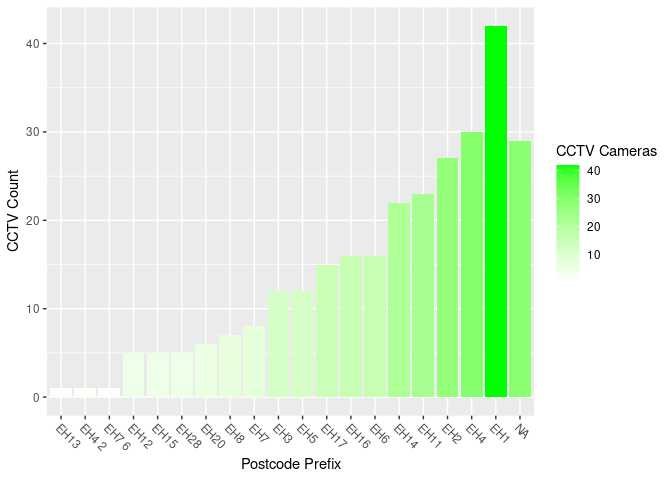
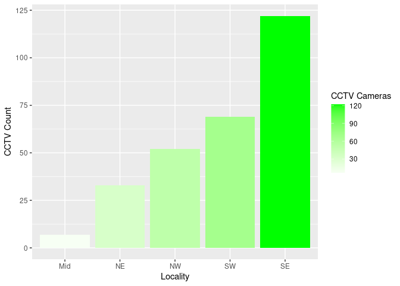

Preview: Sourced Dataframes
================

``` r
knitr::opts_chunk$set(echo = TRUE, include = TRUE)
source("data_input.R")
```

    ## ── Attaching core tidyverse packages ──────────────────────── tidyverse 2.0.0 ──
    ## ✔ dplyr     1.1.4     ✔ purrr     1.0.2
    ## ✔ forcats   1.0.0     ✔ stringr   1.5.1
    ## ✔ ggplot2   3.4.3     ✔ tibble    3.2.1
    ## ✔ lubridate 1.9.3     ✔ tidyr     1.3.0
    ## ── Conflicts ────────────────────────────────────────── tidyverse_conflicts() ──
    ## ✖ dplyr::filter() masks stats::filter()
    ## ✖ dplyr::lag()    masks stats::lag()
    ## ℹ Use the conflicted package (<http://conflicted.r-lib.org/>) to force all conflicts to become errors
    ## Rows: 283 Columns: 11
    ## ── Column specification ────────────────────────────────────────────────────────
    ## Delimiter: ","
    ## chr (5): Location, Location_A, Ward, Locality, Postcode
    ## dbl (6): X, Y, OBJECTID, Camera_Num, Easting, Northing
    ## 
    ## ℹ Use `spec()` to retrieve the full column specification for this data.
    ## ℹ Specify the column types or set `show_col_types = FALSE` to quiet this message.

``` r
library(knitr)
```

## Introduction

This document is used to test and preview the feed of data from the
sourced `data_input.R` file.

At present, the dataset comes from the City of Edinburgh Council’s open
data sets, and shares attributes about each public CCTV camera in the
city.

These attributes include location and ID number.

## Previewing Dataframes

##### df

This is the main dataset, with an added column that takes the initial
prefix of the postcode.

``` r
kable(
  head(df)
)
```

|      X |      Y | OBJECTID | Camera\_Num | Location                  | Location\_A                                                | Ward        | Locality | Easting | Northing | Postcode | PostcodePrefix |
| -----: | -----: | -------: | ----------: | :------------------------ | :--------------------------------------------------------- | :---------- | :------- | ------: | -------: | :------- | :------------- |
| 325608 | 673564 |        1 |        1000 | Lawnmarket                | The junction of Lawnmarket and George IV Bridge, Edinburgh | City Centre | SE       |  325608 |   673564 | EH1 2PH  | EH1            |
| 325672 | 673601 |        2 |        1010 | St Giles Street           | The junction of St Giles St. and High Street, Edinburgh    | City Centre | SE       |  325672 |   673601 | EH1 1RQ  | EH1            |
| 325672 | 673601 |        3 |        1011 | St Giles Street Static    | The junction of St Giles St. and High Street, Edinburgh    | City Centre | SE       |  325672 |   673601 | EH1 1RQ  | EH1            |
| 325734 | 673654 |        4 |        1021 | Warriston Close Static 01 | Warriston’s Close, Edinburgh                               | City Centre | SE       |  325734 |   673654 | EH1 1RQ  | EH1            |
| 325734 | 673654 |        5 |        1022 | Warriston Close Static 02 | Warriston’s Close, Edinburgh                               | City Centre | SE       |  325734 |   673654 | EH1 1RQ  | EH1            |
| 325792 | 673630 |        6 |        1030 | City Chambers             | High St (opposite Old Fishmarket Close), Edinburgh         | City Centre | SE       |  325792 |   673630 | EH1 1YF  | EH1            |

##### postcode\_count

This is a count of cameras by postcode prefix.

``` r
kable(
  postcode_count
)
```

| PostcodePrefix | PostcodeCount |
| :------------- | ------------: |
| EH1            |            42 |
| EH4            |            30 |
| NA             |            29 |
| EH2            |            27 |
| EH11           |            23 |
| EH14           |            22 |
| EH16           |            16 |
| EH6            |            16 |
| EH17           |            15 |
| EH3            |            12 |
| EH5            |            12 |
| EH7            |             8 |
| EH8            |             7 |
| EH20           |             6 |
| EH12           |             5 |
| EH15           |             5 |
| EH28           |             5 |
| EH13           |             1 |
| EH4 2          |             1 |
| EH7 6          |             1 |

##### locality\_count

This is a count of cameras by locality.

``` r
kable(
  locality_count
)
```

| Locality | LocalityCount |
| :------- | ------------: |
| SE       |           122 |
| SW       |            69 |
| NW       |            52 |
| NE       |            33 |
| Mid      |             7 |

## Plotting Counts

``` r
ggplot(
  postcode_count,
  aes(
    reorder(PostcodePrefix, PostcodeCount),
    PostcodeCount,
    fill = PostcodeCount
  )
 ) +
  geom_col() +
  labs(x = "Postcode Prefix", y = "CCTV Count", fill = "CCTV Cameras") +
  scale_fill_gradient2(high = "green", low = "grey") +
  theme(axis.text.x=element_text(angle = -45, hjust = 0))
```

<!-- -->

``` r
ggplot(
  locality_count,
  aes(
    reorder(Locality, LocalityCount),
    LocalityCount,
    fill = LocalityCount
  )
 ) +
  geom_col() +
  labs(x = "Locality", y = "CCTV Count", fill = "CCTV Cameras") +
  scale_fill_gradient2(high = "green", low = "grey")
```

<!-- -->
